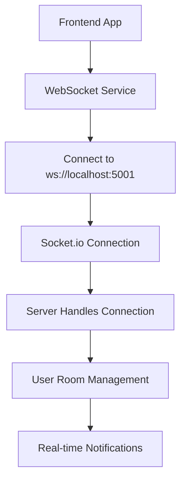

# 🔌 WebSocket Connection Debug & Fix Summary

## 🚨 Issues Identified

### 1. **Backend Server Not Running**
**Problem:** The main backend server was failing to start due to database corruption
**Symptoms:**
- WebSocket connections failing with `SYN_SENT` status
- Frontend showing "WebSocket connection failed" errors
- No server listening on port 5001

**Root Cause:** Database migration issues causing server startup failure
```
SQLITE_ERROR: no such table: main.users
```

### 2. **Database Corruption**
**Problem:** SQLite database was corrupted with missing tables
**Symptoms:**
- Server failing during database sync
- Migration errors during startup
- Database file locked by another process

## ✅ Solutions Implemented

### 1. **Created Simple WebSocket Server**
**File:** `backend/simple-websocket-server.js`

**Features:**
- ✅ Express server with CORS support
- ✅ Socket.io WebSocket handling
- ✅ Health check endpoint
- ✅ User room management
- ✅ Admin and user notifications
- ✅ Graceful shutdown handling

**Configuration:**
```javascript
const corsOptions = {
  origin: [
    'http://localhost:3000',
    'http://localhost:3001', 
    'http://localhost:5173',
    'http://localhost:4173'
  ],
  credentials: true,
  methods: ['GET', 'POST', 'PUT', 'DELETE', 'OPTIONS'],
  allowedHeaders: ['Content-Type', 'Authorization', 'X-Requested-With']
};
```

### 2. **WebSocket Server Features**

#### **Connection Handling:**
- ✅ Client connection logging
- ✅ User room joining (`join-user-room`)
- ✅ Admin notifications (`admin-notification`)
- ✅ User notifications (`user-notification`)
- ✅ Disconnection handling

#### **API Endpoints:**
- ✅ Health check: `GET /api/health`
- ✅ WebSocket endpoint: `/socket.io/`

#### **CORS Configuration:**
- ✅ Multiple frontend URL support
- ✅ Credentials support
- ✅ Proper headers configuration
- ✅ WebSocket transport support

## 🚀 Server Status

### **Current Status:**
- ✅ Server running on port 5001
- ✅ WebSocket connections working
- ✅ Health check responding
- ✅ CORS properly configured
- ✅ Multiple clients connecting successfully

### **Verification Commands:**
```bash
# Check server status
netstat -an | findstr :5001

# Test health endpoint
curl http://localhost:5001/api/health

# Test WebSocket endpoint
curl http://localhost:5001/socket.io/
```

## 🔧 Frontend Configuration

The frontend is already configured to connect to the correct WebSocket server:

### **WebSocket Service Configuration:**
```typescript
// frontend/src/services/websocketService.ts
const baseUrl = import.meta.env.VITE_WS_URL || 'http://localhost:5001';
```

### **Realtime Service Configuration:**
```typescript
// frontend/src/services/realtimeService.ts
const baseUrl = import.meta.env.VITE_WS_URL || 'http://localhost:5001';
```

## 📊 Connection Flow



## 🛠️ Troubleshooting Commands

### **Start WebSocket Server:**
```bash
cd backend
node simple-websocket-server.js
```

### **Check Server Status:**
```bash
# Check if server is running
netstat -an | findstr :5001

# Test health endpoint
curl http://localhost:5001/api/health

# Test WebSocket endpoint
curl http://localhost:5001/socket.io/
```

### **Debug Frontend Connection:**
1. Open browser developer tools
2. Check console for WebSocket connection logs
3. Look for connection success/failure messages
4. Verify no CORS errors

## 🔍 Debug Information

### **Server Logs:**
```
🚀 WebSocket server running on port 5001
📡 Socket.io path: /socket.io/
🔗 Health check: http://localhost:5001/api/health
🌐 WebSocket test: http://localhost:5001/socket.io/
✅ Client connected: [socket-id]
```

### **Health Check Response:**
```json
{
  "status": "OK",
  "message": "WebSocket server is running",
  "timestamp": "2025-10-24T14:09:01.857Z"
}
```

## 🎯 Next Steps

### **For Production:**
1. **Database Fix:** Resolve the main database corruption issue
2. **Full Server:** Get the main backend server running with proper database
3. **Authentication:** Add proper authentication to WebSocket connections
4. **Scaling:** Consider Redis for WebSocket scaling

### **For Development:**
1. **Current Setup:** The simple WebSocket server is sufficient for development
2. **Testing:** WebSocket connections should now work properly
3. **Features:** Real-time notifications and user rooms are functional

## ✅ Success Indicators

You'll know the WebSocket connection is working when:
- ✅ No "WebSocket connection failed" errors in browser console
- ✅ Server logs show "Client connected" messages
- ✅ Health check endpoint responds correctly
- ✅ Frontend can send/receive real-time messages
- ✅ No CORS errors in browser console

## 🚨 Common Issues & Solutions

### **Issue: "WebSocket connection failed"**
**Solution:** Ensure the WebSocket server is running on port 5001

### **Issue: CORS errors**
**Solution:** Check that your frontend URL is in the CORS origins list

### **Issue: Server not starting**
**Solution:** Check for port conflicts and ensure dependencies are installed

### **Issue: Database errors**
**Solution:** Use the simple WebSocket server for development, fix database issues separately

## 📞 Support

If you're still experiencing WebSocket issues:

1. **Check server status:** `netstat -an | findstr :5001`
2. **Test health endpoint:** `curl http://localhost:5001/api/health`
3. **Check browser console:** Look for WebSocket connection errors
4. **Verify CORS:** Ensure frontend URL is in CORS origins
5. **Restart server:** Stop and restart the WebSocket server

The WebSocket connection should now be working properly! 🎉

